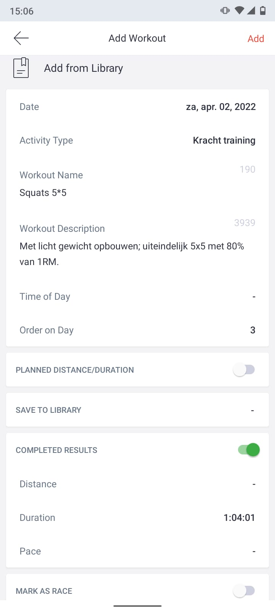

   

## Instructie

We willen je vragen om **al je sportactiviteiten** bij te houden in de app (de cursusles, zelfstandige fitnessbezoeken, rondjes hardlopen, etc.).

Dat doe je onder *My workouts* > **(+)** (rechtsbovenin je scherm).

 

Vul ten minste het volgende in (zie voorbeeld onderaan de pagina):

- type activiteit (*Activity type*)

- hoe lang de activiteit duurde (*Duration*). Als je dit niet invoert, registreert de app jouw activiteit niet als voltooid!

- hoe je je voelde tijdens de workout (*How I felt*)

- de mate van inspanning (*Perceived effort*), op een schaal van 0 (lichte inspanning) tot 10 (maximale inspanning).

Druk op *Add* om de activiteit op te slaan.

    

 

Meer informatie over de functionaliteiten van de app, vind je [hier](https://www.krachtigrsc.nl/extrainfo).