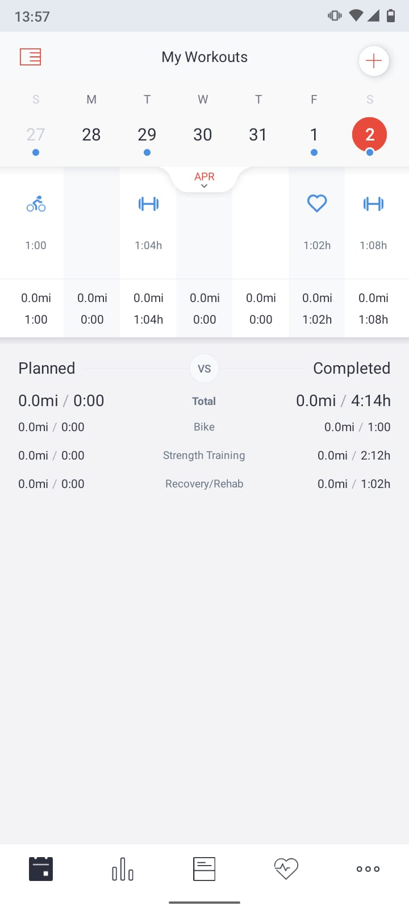
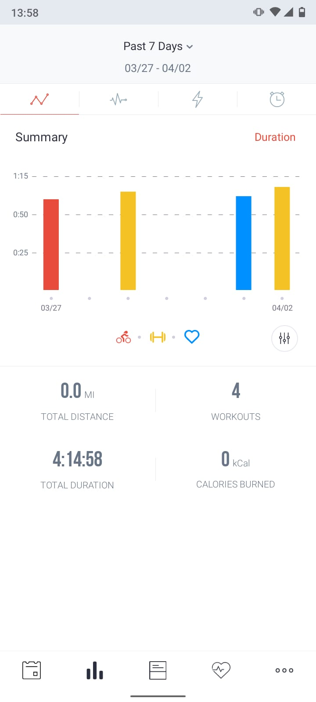
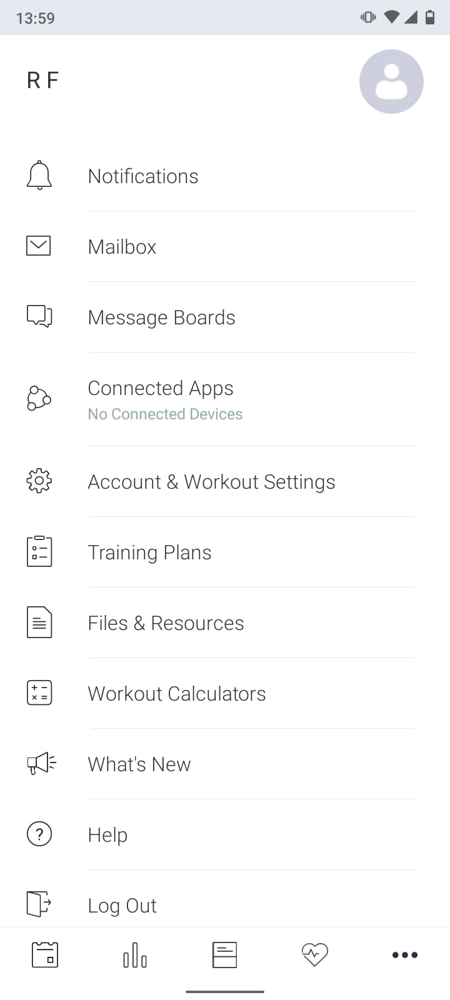

   

<<<<<<< HEAD

De app heeft vijf tabbladen onder in het scherm:

- *My workouts*: dit is je logboek waar je al je activiteiten kunt terugvinden.

    

- *Summary*: dit tabblad geeft een samenvatting van het aantal workouts, en de totale duur van je activiteiten. Je kunt dit uitsplitsen naar activiteit-type (krachttraining, hardlopen, etc.). Met de tabbladen boven in het scherm kun je inzicht krijgen in data over je hartslag, power, en snelheid. Dit is voornamelijk interessant voor wielrenners en hardlopers; niet zozeer voor krachttrainers. 

  

- *Social Wall*: hier heb je de mogelijkheid om je activiteiten te delen met je groepsgenoten, de activiteiten van hen in te zien, en met elkaar te communiceren via *likes* en reacties bij gedeelde activiteiten. De Social Wall is (nog) niet geactiveerd!

- *Data*: in dit tabblad krijg je nog meer gedetailleerde informatie over, o.a., hartslagdata. Dit is voornamelijk nuttig als je de app gesynchroniseerd hebt met een instrument dat deze gegevens automatisch voor je trackt, zoals een smartwatch. Dit is, wederom, minder nuttig voor krachttraining. 

- *Settings*: hier kun je je Mailbox inzien. Je kunt ook je account personaliseren (bijv., primaire sport en taal aanpassen).

    

 

=======
>>>>>>> a8c5e91b49aa0766a46f9262a1f64c0c7cbe7379
## Instructie

We willen je vragen om **al je sportactiviteiten** bij te houden in de app (de cursusles, zelfstandige fitnessbezoeken, rondjes hardlopen, etc.).

Dat doe je onder *My workouts* > **(+)** (rechtsbovenin je scherm).

Vul ten minste het volgende in (zie voorbeeld onderaan de pagina):

- type activiteit (*Activity type*)

- hoe lang de activiteit duurde (*Duration*). Als je dit niet invoert, registreert de app jouw activiteit niet als voltooid!

- hoe je je voelde tijdens de workout (*How I felt*)

- de mate van inspanning (*Perceived effort*), op een schaal van 0 (lichte inspanning) tot 10 (maximale inspanning).

Druk op *Add* om de activiteit op te slaan.

    

 

Meer informatie over de functionaliteiten van de app, vind je [hier](https://www.krachtigrsc.nl/extrainfo).